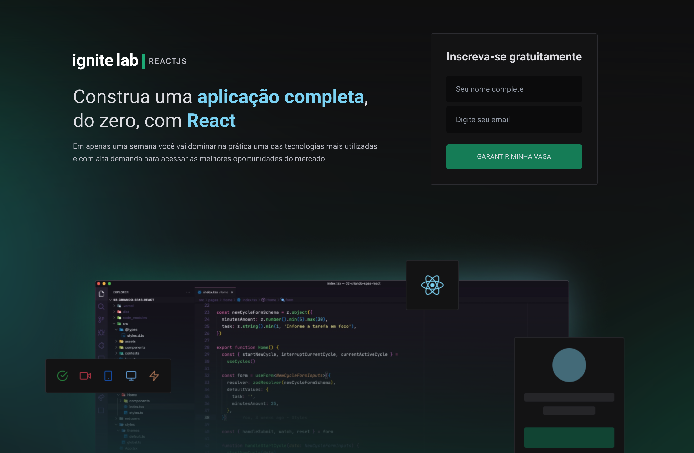

<p align="center">
  
</p>

<h1 align="center">Projeto desenvolvido no Ignite Lab - React JS</h1>

Install dependencies:

```sh
yarn install
```

run project:

```sh
yarn dev
```

## License

All code are **copyright gabrielcaiana** and may not be used or reproduced without explicit permission.